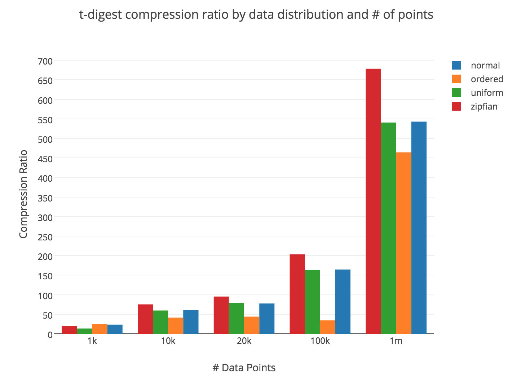

# tdigest #

This is a Go implementation of Ted Dunning's
[t-digest](https://github.com/tdunning/t-digest). It's pretty
barebones, but fast enough to get the job done. It is not currently
safe for concurrent access across goroutines.

The current implementation is backed by slices, which is not as
efficient as using some kind of balanced tree. I plan on adding a tree
implementation when I have time.

## Benchmarks ##

Data compresses well, with compression ratios of around 20 for small
datasets (1k datapoints) and 500 for largeish ones (1M
datapoints). The precise compression ratio depends a bit on your
data's distribution - exponential data does well, while ordered data
does poorly:

In general, adding a datapoint takes about 1 to 4 microseconds on my
2014 Macbook Pro. This is fast enough for many purposes, but if you
have any concern, you should just run the benchmarks on your targeted
syste. You can do that with `go test -bench . ./...`.

Quantiles are very, very quick to calculate, and typically take tens
of nanoseconds. They might take up to a few hundred nanoseconds for
large, poorly compressed (read: ordered) datasets, but in general, you
don't have to worry about the speed of calls to Quantile.
